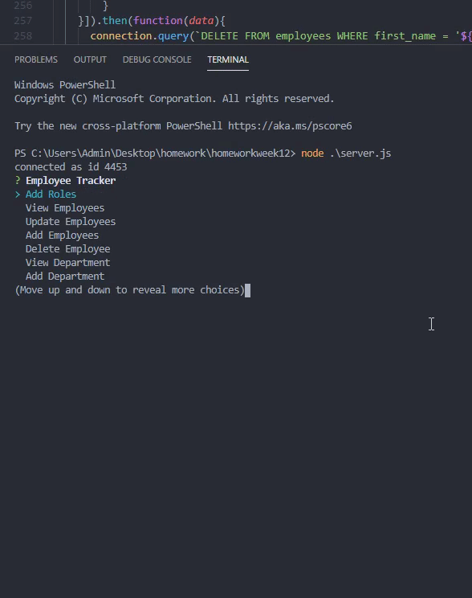

## Employee Tracker ##

## Decription ## 
This console application was created to help track, update, view employees and there respective departments and roles using the console to connect with a mysql database which keeps track of all 
the employee, department and role data all in an easy to use console app.
From the console you will be able to view all of your employees as well as their roles and their departments.
* Add extra Employees, roles and departments
* Update Employees roles
* Delete Employees

## Installation ##

Open the terminal inside the folder with server.js then simply npm install using these commands:
npm install mysql
npm install inquirer
npm install console.table

then simply run the app with node server.js

## Links ##

* https://github.com/Callumwhite210/homeworkweek12